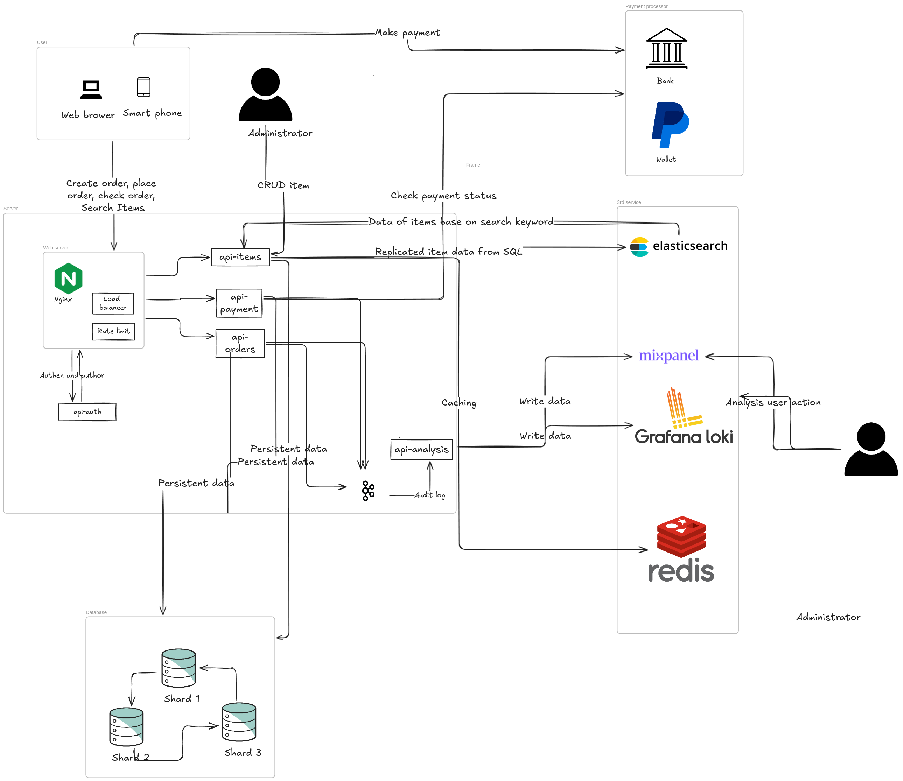

# Challenge 7
## Question
```
System design
Design a high load payment system.
The problems:
- During the Black Friday, the system needs to handle 3000 concurrent requests.
- The frequency of balance/transaction inquiry is usually 5 times higher than requesting
payments e.g. 2500 reads + 500 writes
- Reliability is expected, e.g. we don’t want to approve any inappropriate payments.
- User experience is also important, low-latency is expected.
Resource limit:
- We have 6 servers where up to 3 servers could be used for the relational databases.
One database can open 250 connections.

```
## Answer


### Make assumptions

In this analysis, I will outline functional and non-functional requirements for a website designed to facilitate user orders and payments during Black Friday. 
The system must handle 3,000 requests per second, with 2,500 of these being read requests and the remainder being write requests.

- Functional requirement
    - Customer can login, logout.
    - Customer can search for items.
    - Customer can put some item in order cart.
    - Customer can make order with item in order cart.
    - Customer can make the payment for their orders.
    - The system must verify item availability against the inventory.
    - Admins can add new items and update item information.
    - Customers can view their orders.
- Non-functional requirement
    - The system must handle 3,000 concurrent requests, including 500 write requests.
    - Item contention must remain below the overall concurrent write request limit, estimated at 50 requests per second.
    - The server must support horizontal scaling for read requests.
    - There must be mechanisms between multiple servers to keep the system state consistent, particularly regarding financial transactions, with no margin for error.


### Analysis
The system consists of two main components: the customer interface and the admin interface, 
with customer traffic expected to be significantly higher. 
Users will primarily engage in searching for and ordering items, generating substantial backend requests.

`Handling Read Requests`: Read requests can be efficiently managed by replicating data from a SQL database to a search engine like AWS OpenSearch, 
which supports horizontal scaling. This approach will improve response times and user experience. Another way is implement some sort of cache strategy to improve the performance, because it is data of items, a bit slowly is not a problem. 
By offloading part of the workload to a cloud service, we can keep sensitive data on our six servers, with three dedicated to the database, while replicating non-sensitive metadata.
This scalability is advantageous as user traffic may initially be low and can be adjusted dynamically as demand increases.

`Handling Write Requests`: Managing write requests presents more challenges, particularly in maintaining data consistency and ensuring rapid response times. The steps involved when a customer places an order are as follows:
- `Create Order`: The system creates an order and holds a specified number of items, implementing a timeout for the hold action.
- `Make Payment`: The user submits payment for the order.
- `Place Order`: The system verifies that payment was successful and that the hold record is still valid.

In the create order and place order steps, we can use the `SELECT FOR UPDATE` mechanism in the database to keep data consistent. For example, when we hold the number of items in the inventory, we need to lock this record in the database.

This step will impact the performance of the database. In my assumptions, I estimated that there are 50 requests per second for each item, totaling 500 requests per second across all items. Each server can handle 250 requests per second, and with three servers in a master-slave configuration, we still have 250 requests per second for write requests but can increase the number of read requests we can handle. The number of read requests does not make sense here because we have Elasticsearch to handle most of the customer read requests. The important point here is that we need to improve the number of write requests we can handle.

Sharding is the best match for this use case. The challenge here is determining the sharding key because transactions across shards can negatively impact performance. This means that if we choose the sharding key as the item ID, it will significantly downgrade performance. If we choose the sharding key as the category ID of the item, the sharding will be more effective. There is a higher chance that customers will place multiple items in the same category.

With this approach, the order will be placed in one shard. If not, we need to split the order into two separate orders, each with the same category ID, and we will process payments for each individual order. Since the requirements have no constraints regarding coupons, this will not affect the customer experience. With sharding, if we increase the number of servers, the number of requests that can be supported increases linearly. With three servers, we can handle 750 requests per second, which meets the requirements.

In the next step, the customer will make the payment for the order. When the customer sends the request, we will send the QR code to the customer. The customer will then send the payment to that QR code. Our service will regularly check the amount in the virtual account (associated with the QR code) to confirm if the payment was successful. We need to check the payment for a limited time, for example, checking every five seconds for two minutes to ensure the order succeeded.

Regarding the investigation of customer behavior, we can send audit logs from our services to third-party tools like Loki or Mixpanel for analysis. We can send this data over Kafka for reliability.


### High level design

## Endpoinnt design
| API             | Method | Endpoint                     | Description                                                    | Request Body                                                                                                                                                       |
|-----------------|--------|------------------------------|----------------------------------------------------------------|--------------------------------------------------------------------------------------------------------------------------------------------------------------------|
| **api-auth**    | POST   | `/user`                      | Create new user                                                | ```json { "username": "johndoe", "password": "password123", "email": "johndoe@example.com", "phone": "+1234567890" } ```                                           |
| **api-auth**    | POST   | `/user/login`                | User Login                                                     | ```json { "username": "johndoe", "password": "password123" } ```                                                                                                   |
| **api-auth**    | POST   | `/user/logout`               | User Logout                                                    | ```json { "token": "eyJhbGciOiJIUzI1NiIsInR5cCI6IkpXVCJ9..." } ```                                                                                                 |
| **api-orders**  | POST   | `/order/`                    | Customer create order                                          | ```json { "customerId": "12345", "items": [ { "itemId": "56789", "quantity": 2 }, { "itemId": "67890", "quantity": 1 } ] } ```                                    |
| **api-orders**  | GET    | `/customer/orders/index/`    | Get all orders for a specific customer (customer ID in header) | -                                                                                                                                                                  |
| **api-orders**  | GET    | `/admin/orders/index/`       | Admin get all orders                                           | -                                                                                                                                                                  |
| **api-orders**  | GET    | `/order/:id/`                | Get specific order by ID (customer or admin)                   | -                                                                                                                                                                  |
| **api-orders**  | POST   | `/order/place`               | Customer place an order                                        | ```json { "orderId": "98765" } ```                                                                                                                                 |
| **api-orders**  | PUT    | `/order/cancel`              | Cancel a order and refund payment                              | ```json { "orderId": "98765" } ```                                                                                                                                 |
| **api-payment** | POST   | `/payment/`                  | Create a payment for an order                                  | ```json { "orderId": "98765", "paymentMethod": "credit_card", "amount": 109.97, "currency": "USD" } ```                                                           |
| **api-payment** | GET    | `/payment/by-order/:orderId` | Get payment by order ID                                        | -                                                                                                                                                                  |
| **api-items**   | POST   | `/item/`                     | Admin create an item                                           | ```json { "name": "Wireless Mouse", "description": "Ergonomic wireless mouse with USB connectivity", "category": "Electronics", "price": 29.99, "currency": "USD", "stockQuantity": 100, "location": "Warehouse A" } ``` |
| **api-items**   | DELETE | `/item/:id`                  | Admin delete an item                                           | -                                                                                                                                                                  |
| **api-items**   | PUT    | `/item/:id`                  | Admin update item information                                  | ```json { "name": "Wireless Mouse Pro", "price": 34.99, "currency": "USD" } ```                                                                                   |
| **api-items**   | PUT    | `/item/quantity`             | Admin update item quantity                                     | ```json { "itemId": "56789", "newQuantity": 150 } ```                                                                                                              |
| **api-items**   | GET    | `/items/search`              | Customer/Admin search for items                                | ```json { "query": "wireless", "category": "Electronics" } ```                                                                                                     |
| **api-items**   | PUT    | `/item/hold/check-release`   | Check and release hold record if order is not placed           | ```json { "orderId": "98765", "expiryTime": "2024-10-07T13:05:00Z" } ```                                                                        |
## Architecture diagram



[Link to draw](https://excalidraw.com/#json=GgRb7gR8WD018BTY_C8cj,jzEre_oUIJGm_6OpOniYdA)


### Database diagram


| Enum Type       | Field             | Possible Values                                    |
|-----------------|-------------------|----------------------------------------------------|
| **OrderStatus** | `ORDERS.status`   | `"Pending"`, `"Placed"`, `"Canceled"`, `"Failed"`  |
| **PaymentStatus** | `PAYMENTS.status` | `"Pending"`, `"Completed"`, `"Refunded"`, `"Failed"` |
| **HoldStatus**  | `HOLD_RECORDS.status` | `"Active"`, `"Released"`, `"Expired"`               |


### Sequence diagram

- Search items


- View items details

- Create order

- Make payment for order


- Place order


- Order cancellation


- Cron job to release hold item records for orders that were created but not placed.


- Cronjob to release the payment for orders that were created but not placed


### Further improvement
- Use Redis for locking by orderId to prevent concurrency issues during simultaneous update requests.
- Implement batching in cron job and search steps to reduce I/O time between services and persistent storage.
- Apply circuit breakers for external service calls (e.g., payment gateways) to handle potential slowdowns or failures gracefully, preventing system-wide impacts.
