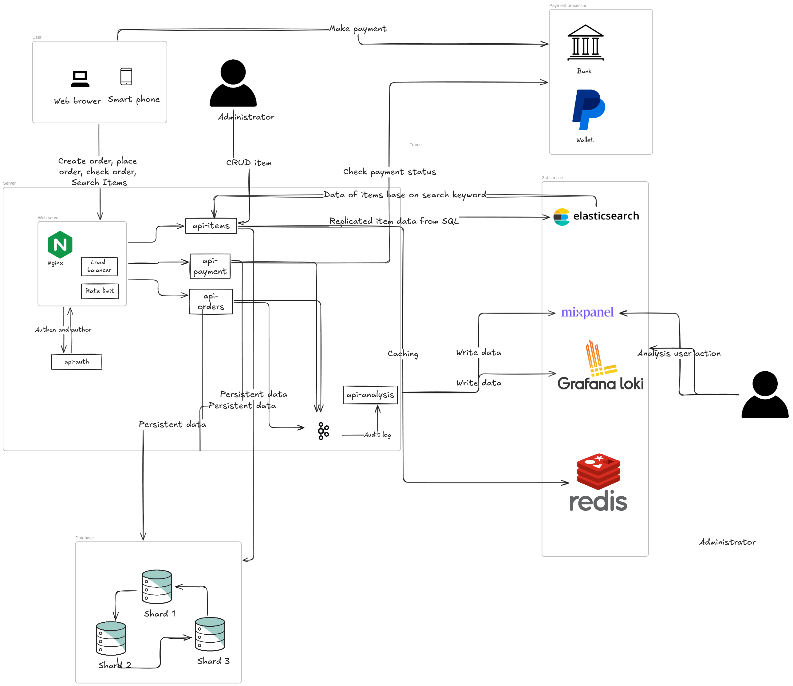
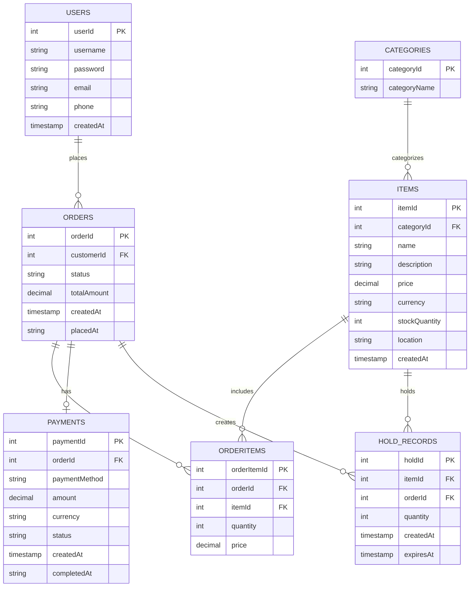
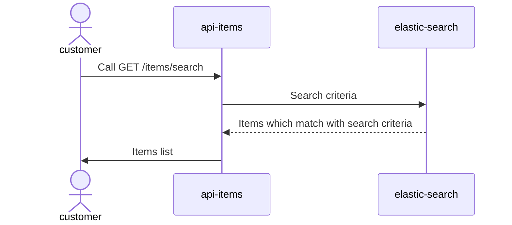
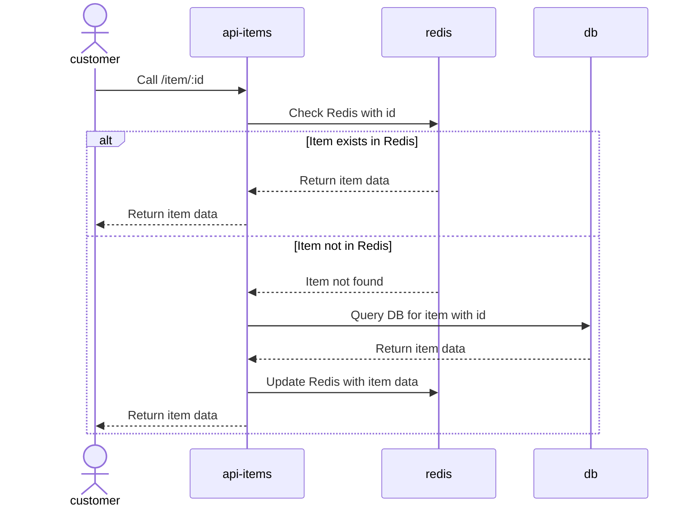
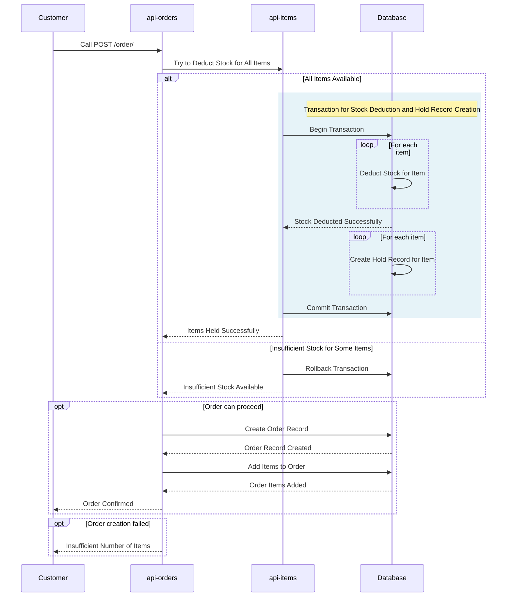
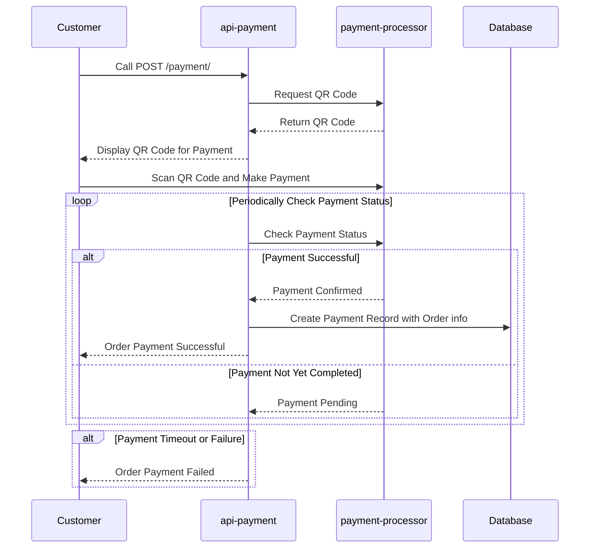
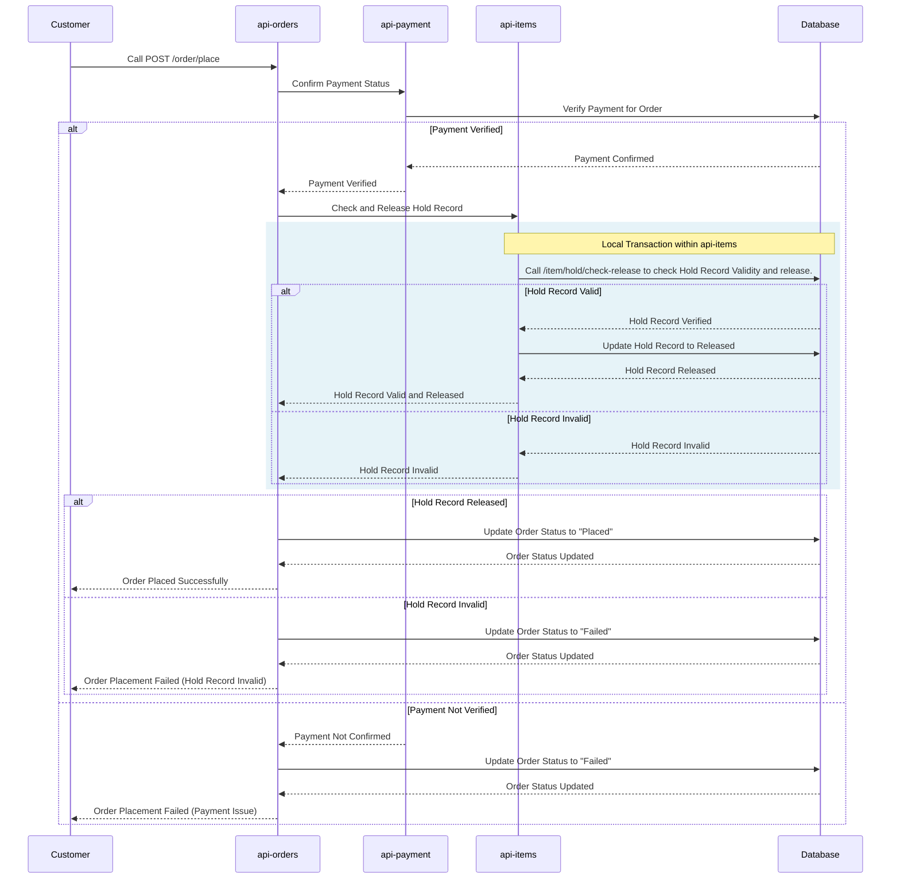
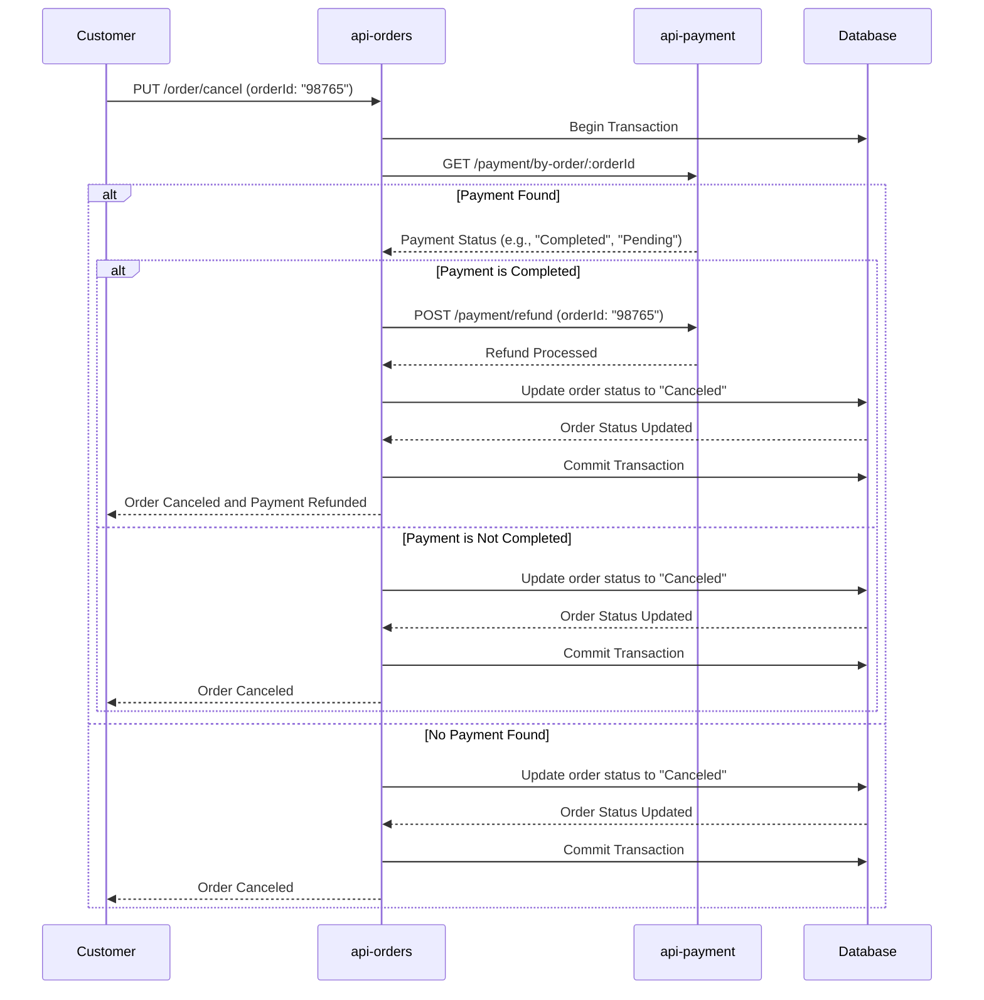
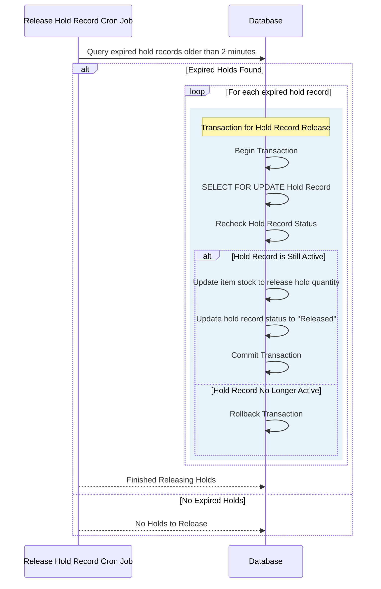
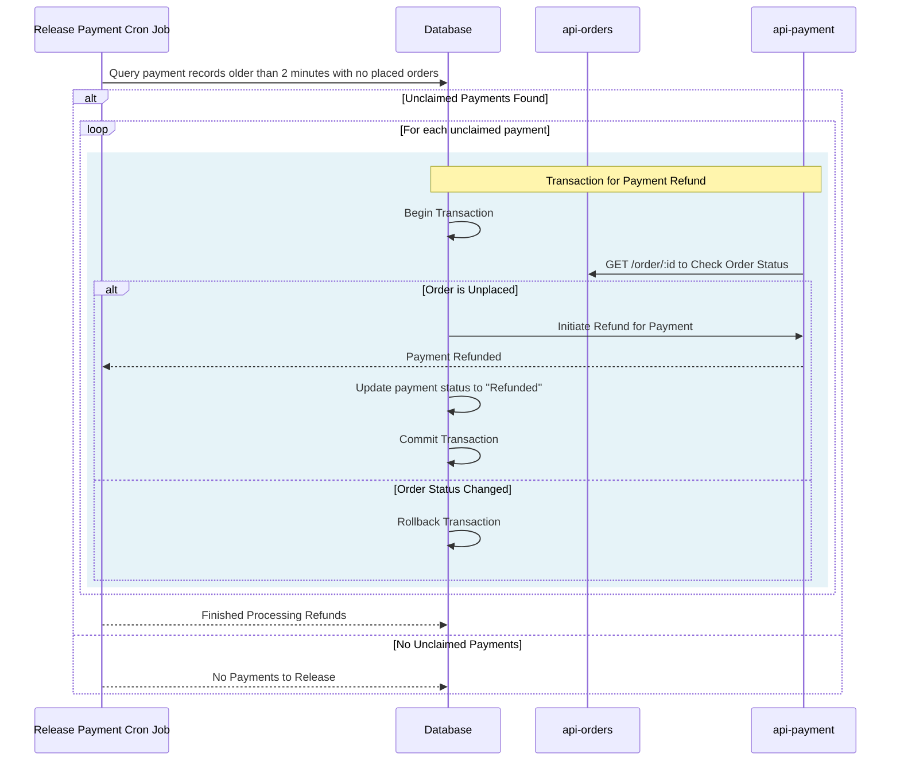

## Challenge 1
### Question
```
Your team member is going to expose these APIs, what is your feedback regarding to API
design?
Get /users
POST /users/new
POST /users/:id/update
POST /users/:id/rename
POST /users/:id/update-timezone
DELETE /users/delete?id=:id
Optional: what’s your personal opinion on CRUD endpoints?
```
### Answer
The API design needs to be improved. Some endpoints are not consistent and do not follow RESTful best practices.

- `GET /users`: This is generally okay, but I believe you should allow for query parameters like `page` or `filter` for pagination or filtering.
- `POST /users/new`: Change this to `POST /users`. The `POST` method inherently means creating a resource, so there’s no need to include `/new`.
- `POST /users/:id/update`: Change this to `PUT /user/:id`. Remove the `s` from `users` and omit the `update` keyword since `PUT` inherently implies updating a resource.
- `POST /users/:id/rename`: Change this to `PATCH /user/:id/name`. `PATCH` is more suitable for updating specific fields, like a name.
- `POST /users/:id/update-timezone`: Change this to `PATCH /user/:id/timezone` for the same reason as the name update endpoint.
- `DELETE /users/delete?id=:id`: Change this to `DELETE /user/:id`. Using a path parameter is more appropriate for deletions than query strings.

**My opinion on CRUD endpoints**:

- **Clarity and consistency**: Using clear and consistent HTTP methods makes it easy for both developers and clients to understand the intent of each endpoint.
- **Simplicity**: By avoiding unnecessary actions in the endpoint path (such as `/new`, `/rename`), we reduce complexity. The HTTP method should clearly indicate the intent of the endpoint.
- **Consistency**: Following RESTful standards ensures uniformity across larger projects.

## Challenge 2
### Question
```
What is your feedback when you review this code? Would you give this a `lgtm`?
public class Account {
 private int debitBalance;
 private int creditBalance;

 void increaseBalance(int amount, boolean isCredit){
 if(isCredit) {
 this.creditBalance += amount;
 } else {
 this.debitBalance += amount;
 }
 }
 //getter,setter
}
```
### Answer

The block of code has several issues:

- The method `increaseBalance` is not synchronized. If multiple threads attempt to modify the balance simultaneously, it can lead to inconsistent states or race conditions.
- The code doesn't check whether the `amount` is greater than 0. This can lead to negative values being added, which might not be intended in the business logic.
- The `int` data type is used for the balances, which is insufficient for financial calculations where precision and large values are crucial. Financial values should not use `int` or `float` due to overflow and precision issues. Consider replacing `int` with `BigDecimal`.


## Challenge 3
### Question
```
What performance issue related to the database can you see in the following code, and how
are you going to fix it?
We have a database to store course and student on two different tables, this function is to load
students belong to first 1000 courses
public void loadStudents(){
 List<Course> courses = loadFirst1000Courses();
 for (Course course: courses) {
 List<Student> student = loadStudentFromCourse(course);
 print(student); 
 }
}
```
### Answer

- **The problem**: This code has an N+1 problem. First, it loads 1000 courses, and for each course, it fetches the students. This results in 1001 queries in total (1 for loading the courses and 1 for each course's students). Executing so many queries will negatively affect performance. Another issue with the code is that it does not remove duplicate students.

- **The solution**: Batch the queries. Instead of executing one query per course to load its students, you can fetch all students for 1000 courses in fewer queries using a `JOIN` or `IN` clause.

#### How to fix it:

- Batch the queries: Instead of fetching students for each course individually, we will use a single query to fetch all students for a batch of courses.
- We will use an `IN` clause or a `JOIN` between the courses and students tables to fetch all students for a batch of courses.
- This will reduce the number of queries and optimize performance.

```java

import java.util.Collection;
import java.util.List;
import java.util.stream.Stream;

record Course(String id) {
}

record Student(String id) {
    // It has default equal and hashCode
}

public class StudentLoader {
    private final int COURSE_BATCH_SIZE = 100;
    private final int STUDENT_COURSE_LIMIT = 1000;

    public void loadStudents() {
        Stream<List<Course>> courcesStream = getCoursesInBatch();
        courcesStream.map(courses -> courses.stream().map(Course::id).toList())
                .flatMap(this::getStudentInBatchByCourseIds)
                .flatMap(Collection::stream)
                .distinct() // Student has default equal and hashCode
                .forEach(this::printStudent);
    }

    private Stream<List<Course>> getCoursesInBatch() {
        int TOTAL_COURSE_LIMIT = 1000;
        return Stream.iterate(0, offset -> offset + COURSE_BATCH_SIZE)
                .map(offset -> databaseLoadCourses(offset, COURSE_BATCH_SIZE))
                .takeWhile(List::isEmpty)
                .limit(TOTAL_COURSE_LIMIT);
    }

    private Stream<List<Student>> getStudentInBatchByCourseIds(List<String> courseIds) {
        return Stream.iterate(0, offset -> offset + STUDENT_COURSE_LIMIT)
                .map(offset -> databaseLoadStudents(courseIds, offset, STUDENT_COURSE_LIMIT))
                .takeWhile(List::isEmpty);
    }

    private void printStudent(Student student) {
        System.out.println(student);
    }

    private List<Course> databaseLoadCourses(int limit, int offset) {
        // SQL Query like:
        // SELECT * FROM courses LIMIT limit OFFSET offset;
        return null;
    }

    private List<Student> databaseLoadStudents(List<String> courseIds, int limit, int offset) {
        // SQL Query like:
        // SELECT * FROM students WHERE course_id IN (:courseIds);
        // or a JOIN-based query for more complex fetching:
        // SELECT students.* FROM students JOIN courses ON students.course_id = courses.id WHERE courses.id IN (:courseIds);
        return null;
    }

}

```

## Challenge 4
### Question
```
This piece of code is the logic behind an API for transfer money, we’re using RDBMS e.g.
MySQL as our persistent layer.
What database-related (2-3) issues would you find in this method?
Hint: It’s pseudo code, therefore don’t focus on coding syntax. 

function transfer(fromAccId, toAccId, amount) {
 var from = findByAccountId(fromAccId);
 var to = findByAccountId(toAccId);
 if(from.balance < amount) {
 throw new BalanceErrorException("not enough balance to transfer");
 }
 updateBalance(from, balance - amount);
 updateBalance(to, balance - amount);
}
```
### Answer

Database-related issues in the transfer method:

- **No transaction handling**: The method lacks a transaction block, meaning if the process fails partway (e.g., debiting the sender succeeds but crediting the receiver fails), the system could be left in an inconsistent state.

- **Concurrency issues**: The `findByAccountId` method does not acquire a row-level lock (SELECT ... FOR UPDATE), allowing concurrent transactions to potentially modify balances simultaneously, which could cause race conditions and inconsistent data. It should be `findAndLockByAccountId`.
- **Incorrect balance update logic**: The updateBalance method incorrectly subtracts the amount from both the sender's and receiver's balances. It should subtract from the sender's account and add to the receiver's account.

>**Note**: There is no need to worry about deadlocks here because the database has mechanisms to detect deadlocks and handle them by throwing an error.


## Challenge 5
### Question
```
We found this code in our git repository, what problems related to application security can
you see in the following code?
// A service store user credentials and authenticate user (login)
class User {
 /**
 * Use salted password
 */
 private static final String PASSWORD_SALT = "tymesalt";
 /**
 * Stored password hashed
 */
 private String hashedPassword;
 /**
 * Authenticates user against given password, return true if the password matches
 * @param password
 * @return
 */
 public boolean verifyPassword(String password){
 if (isNullOrEmpty(hashed_password) || isNullOrEmpty(password)) {
 return false;
 } else {
 return this.hashPassword(password).equals(hashedPassword);
 }
 }
 /**
 * Update password
TYME GLOBAL Developer Quiz
 * @param newPassword
 */
 public void changePassword(String newPassword) {
 this.hashedPassword = this.hashPassword(newPassword);
 }
 /**
 * Generate hash from given password
 * @param password
 * @return
 */
 private String hashPassword(String password){
 //generate md5hash of a string
 return md5Hash(password + PASSWORD_SALT);
 }
}
```
### Answer

Some problem in code:
- **Weak hashing algorithm `MD5`**: The code uses md5Hash to hash the password. MD5 is a cryptographically broken and unsuitable hashing algorithm for password storage. It is vulnerable to brute-force attacks and collision attacks.. Refer https://owasp.org/www-project-mobile-top-10/2016-risks/m5-insufficient-cryptography
- **Static password salt**: Using a static salt (e.g., PASSWORD_SALT = "tymesalt") is insecure. Attackers can use precomputed rainbow tables to reverse MD5 hashes if the salt is known. A unique salt should be generated for each user.
- **Password in String**: Passwords are handled as String, which means they could stay in memory longer than necessary and are vulnerable to memory dumps. Passwords should be stored in char[] and cleared from memory as soon as they are no longer needed.
  Refer: https://docs.oracle.com/javase/6/docs/technotes/guides/security/crypto/CryptoSpec.html#PBEEx

## Challenge 6
### Question
```
Database queries are getting slow when the database size increases. What are your
suggestions to improve performance over the time?
Hint: List out 4 solutions.
```

### Answer
| **Method**      | **Descriptions**                                                                                                                                                                                                                                              | **Advantage**                                                   | **Disadvantage**                                                                                                  |
|-----------------|--------------------------------------------------------------------------------------------------------------------------------------------------------------------------------------------------------------------------------------------------------------|-----------------------------------------------------------------|--------------------------------------------------------------------------------------------------------------------|
| **Indexing**    | Create indexes on columns used in `WHERE`, `JOIN`, or sometimes in `SELECT` (index-only scan) queries to allow databases to retrieve rows more efficiently without full table scans. Regularly monitor with `EXPLAIN` to identify queries not using indexes.    | Easy to create and supported by almost all databases.            | Slows down `INSERT`, `UPDATE`, and `DELETE` queries, as they require time to update the index.                     |
| **Sharding**    | Splitting a database into smaller parts called `shards`. Each host maintains a portion of the data, distributing the load across multiple servers.                                                                                                             | Distributes load. Significantly improves performance.            | Not supported by every database, and cross-shard queries can be slow.                                             |
| **Partitioning**| Dividing large tables into smaller parts (partitions) based on a specific column.                                                                                                                                                                              | Reduces the amount of data that needs to be scanned for queries. | Queries spanning partitions may still be slow. Some databases do not support unique indexes across partitions.     |
| **Caching**     | Storing frequently accessed data in memory (RAM) using tools like Redis or Memcached to reduce database load and provide faster response times.                                                                                                                | Very fast retrieval of cached data.                              | Requires implementing cache invalidation mechanisms and cannot be used for real-time strict data.                  |

# Challenge 7
## Question
```
System design
Design a high load payment system.
The problems:
- During the Black Friday, the system needs to handle 3000 concurrent requests.
- The frequency of balance/transaction inquiry is usually 5 times higher than requesting
payments e.g. 2500 reads + 500 writes
- Reliability is expected, e.g. we don’t want to approve any inappropriate payments.
- User experience is also important, low-latency is expected.
Resource limit:
- We have 6 servers where up to 3 servers could be used for the relational databases.
One database can open 250 connections.

```
## Answer


### Make assumptions

In this analysis, I will outline functional and non-functional requirements for a website designed to facilitate user orders and payments during Black Friday. 
The system must handle 3,000 requests per second, with 2,500 of these being read requests and the remainder being write requests.

- Functional requirement
    - Customer can login, logout.
    - Customer can search for items.
    - Customer can put some item in order cart.
    - Customer can make order with item in order cart.
    - Customer can make the payment for their orders.
    - The system must verify item availability against the inventory.
    - Admins can add new items and update item information.
    - Customers can view their orders.
- Non-functional requirement
    - The system must handle 3,000 concurrent requests, including 500 write requests.
    - Item contention must remain below the overall concurrent write request limit, estimated at 50 requests per second.
    - The server must support horizontal scaling for read requests.
    - There must be mechanisms between multiple servers to keep the system state consistent, particularly regarding financial transactions, with no margin for error.


### Analysis
The system consists of two main components: the customer interface and the admin interface, 
with customer traffic expected to be significantly higher. 
Users will primarily engage in searching for and ordering items, generating substantial backend requests.

`Handling Read Requests`: Read requests can be efficiently managed by replicating data from a SQL database to a search engine like AWS OpenSearch, 
which supports horizontal scaling. This approach will improve response times and user experience. Another way is implement some sort of cache strategy to improve the performance, because it is data of items, a bit slowly is not a problem. 
By offloading part of the workload to a cloud service, we can keep sensitive data on our six servers, with three dedicated to the database, while replicating non-sensitive metadata.
This scalability is advantageous as user traffic may initially be low and can be adjusted dynamically as demand increases.

`Handling Write Requests`: Managing write requests presents more challenges, particularly in maintaining data consistency and ensuring rapid response times. The steps involved when a customer places an order are as follows:
- `Create Order`: The system creates an order and holds a specified number of items, implementing a timeout for the hold action.
- `Make Payment`: The user submits payment for the order.
- `Place Order`: The system verifies that payment was successful and that the hold record is still valid.

In the create order and place order steps, we can use the `SELECT FOR UPDATE` mechanism in the database to keep data consistent. For example, when we hold the number of items in the inventory, we need to lock this record in the database.

This step will impact the performance of the database. In my assumptions, I estimated that there are 50 requests per second for each item, totaling 500 requests per second across all items. Each server can handle 250 requests per second, and with three servers in a master-slave configuration, we still have 250 requests per second for write requests but can increase the number of read requests we can handle. The number of read requests does not make sense here because we have Elasticsearch to handle most of the customer read requests. The important point here is that we need to improve the number of write requests we can handle.

Sharding is the best match for this use case. The challenge here is determining the sharding key because transactions across shards can negatively impact performance. This means that if we choose the sharding key as the item ID, it will significantly downgrade performance. If we choose the sharding key as the category ID of the item, the sharding will be more effective. There is a higher chance that customers will place multiple items in the same category.

With this approach, the order will be placed in one shard. If not, we need to split the order into two separate orders, each with the same category ID, and we will process payments for each individual order. Since the requirements have no constraints regarding coupons, this will not affect the customer experience. With sharding, if we increase the number of servers, the number of requests that can be supported increases linearly. With three servers, we can handle 750 requests per second, which meets the requirements.

In the next step, the customer will make the payment for the order. When the customer sends the request, we will send the QR code to the customer. The customer will then send the payment to that QR code. Our service will regularly check the amount in the virtual account (associated with the QR code) to confirm if the payment was successful. We need to check the payment for a limited time, for example, checking every five seconds for two minutes to ensure the order succeeded.

Regarding the investigation of customer behavior, we can send audit logs from our services to third-party tools like Loki or Mixpanel for analysis. We can send this data over Kafka for reliability.


### High level design

## Endpoinnt design

| API             | Method | Endpoint                     | Description                                                    | Request Body                                                                                                                                                |
|-----------------|--------|------------------------------|----------------------------------------------------------------|-------------------------------------------------------------------------------------------------------------------------------------------------------------|
| **api-auth**    | POST   | `/user`                      | Create new user                                                | ```json { "username": "johndoe", "password": "password123", "email": "johndoe@example.com", "phone": "+1234567890" } ```                                    |
| **api-auth**    | POST   | `/user/login`                | User Login                                                     | ```json { "username": "johndoe", "password": "password123" } ```                                                                                            |
| **api-auth**    | POST   | `/user/logout`               | User Logout                                                    | ```json { "token": "eyJhbGciOiJIUzI1NiIsInR5cCI6IkpXVCJ9..." } ```                                                                                          |
| **api-orders**  | POST   | `/order/`                    | Customer create order                                          | ```json { "customerId": "12345", "items": [ { "itemId": "56789", "quantity": 2 }, { "itemId": "67890", "quantity": 1 } ] } ```                             |
| **api-orders**  | GET    | `/customer/orders/index/`    | Get all orders for a specific customer (customer ID in header) | -                                                                                                                                                           |
| **api-orders**  | GET    | `/admin/orders/index/`       | Admin get all orders                                           | -                                                                                                                                                           |
| **api-orders**  | GET    | `/order/:id/`                | Get specific order by ID (customer or admin)                   | -                                                                                                                                                           |
| **api-orders**  | POST   | `/order/place`               | Customer place an order                                        | ```json { "orderId": "98765" } ```                                                                                                                          |
| **api-orders**  | PUT    | `/order/cancel`              | Cancel a order and refund payment                              | ```json { "orderId": "98765" } ```                                                                                                                          |
| **api-payment** | POST   | `/payment/`                  | Create a payment for an order                                  | ```json { "orderId": "98765", "paymentMethod": "credit_card", "amount": 109.97, "currency": "USD" } ```                                                    |
| **api-payment** | GET    | `/payment/by-order/:orderId` | Get payment by order ID                                        | -                                                                                                                                                           |
| **api-items**   | POST   | `/item/`                     | Admin create an item                                           | ```json { "name": "Wireless Mouse", "description": "Ergonomic wireless mouse with USB connectivity", "category": "Electronics", "price": 29.99, "currency": "USD", "stockQuantity": 100, "location": "Warehouse A" } ``` |
| **api-items**   | DELETE | `/item/:id`                  | Admin delete an item                                           | -                                                                                                                                                           |
| **api-items**   | PUT    | `/item/:id`                  | Admin update item information                                  | ```json { "name": "Wireless Mouse Pro", "price": 34.99, "currency": "USD" } ```                                                                            |
| **api-items**   | PUT    | `/item/quantity`             | Admin update item quantity                                     | ```json { "itemId": "56789", "newQuantity": 150 } ```                                                                                                       |
| **api-items**   | GET    | `/items/search`              | Customer/Admin search for items                                | ```json { "query": "wireless", "category": "Electronics" } ```                                                                                              |
| **api-items**   | PUT    | `/item/hold/check-release`   | Check and release hold record if order is not placed           | ```json { "orderId": "98765", "expiryTime": "2024-10-07T13:05:00Z" } ```                                                                                   |

## Architecture diagram



[Link to draw](https://excalidraw.com/#json=GgRb7gR8WD018BTY_C8cj,jzEre_oUIJGm_6OpOniYdA)


### Database diagram



| Enum Type       | Field             | Possible Values                                    |
|-----------------|-------------------|----------------------------------------------------|
| **OrderStatus** | `ORDERS.status`   | `"Pending"`, `"Placed"`, `"Canceled"`, `"Failed"`  |
| **PaymentStatus** | `PAYMENTS.status` | `"Pending"`, `"Completed"`, `"Refunded"`, `"Failed"` |
| **HoldStatus**  | `HOLD_RECORDS.status` | `"Active"`, `"Released"`, `"Expired"`               |


### Sequence diagram

- Search items



- View items details

- Create order

- Make payment for order


- Place order



- Order cancellation




- Cron job to release hold item records for orders that were created but not placed.


- Cronjob to release the payment for orders that were created but not placed




### Further improvement
- Use Redis for locking by orderId to prevent concurrency issues during simultaneous update requests.
- Implement batching in cron job and search steps to reduce I/O time between services and persistent storage.
- Apply circuit breakers for external service calls (e.g., payment gateways) to handle potential slowdowns or failures gracefully, preventing system-wide impacts.
